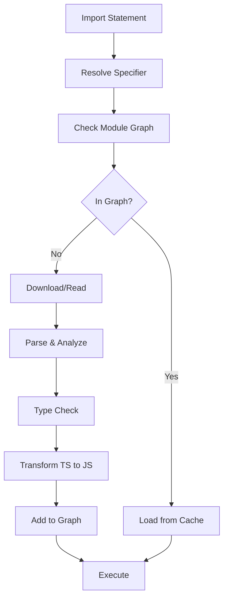

## Overview

Deno uses modern ES modules (ESM) as its standard module system. Unlike Node.js, Deno does not support CommonJS `require()` by default (except for Node.js compatibility mode). All modules use standard `import` and `export` syntax.

<Info>
Deno's module system is built on web standards, using the same import syntax as browsers.
</Info>

## Import Syntax

### ES Module Imports

```typescript
// Named imports
import { serve } from "https://deno.land/std@0.220.0/http/server.ts";

// Default imports
import express from "npm:express@4";

// Namespace imports
import * as path from "node:path";

// Type-only imports
import type { Handler } from "./types.ts";

// Dynamic imports
const module = await import("./dynamic.ts");
```

### Import Maps

Import maps allow you to control module resolution:

<CodeGroup>
```json deno.json
{
  "imports": {
    "std/": "https://deno.land/std@0.220.0/",
    "@/": "./src/",
    "react": "npm:react@18.2.0"
  }
}
```

```typescript Usage
import { serve } from "std/http/server.ts";
import { utils } from "@/utils.ts";
import React from "react";
```
</CodeGroup>

## Module Resolution

From the source code (`cli/module_loader.rs`), Deno resolves modules in this order:

### 1. File Protocol

Local filesystem modules using absolute or relative paths:

```typescript
// Relative imports
import { helper } from "./utils.ts";
import { config } from "../config.ts";

// Absolute file URLs
import { data } from "file:///home/user/project/data.ts";
```

<Note>
All local imports must include file extensions. Deno does not support extensionless imports like `"./utils"`.
</Note>

### 2. HTTPS Protocol

Remote modules from any HTTPS URL:

```typescript
import { assertEquals } from "https://deno.land/std@0.220.0/assert/mod.ts";
import { Application } from "https://deno.land/x/oak@v12.6.0/mod.ts";
```

Remote modules are:
- Downloaded on first use
- Cached locally in `$DENO_DIR`
- Reused from cache on subsequent runs
- Integrity-checked via lockfile

### 3. NPM Protocol

Node.js packages from npm registry:

```typescript
// Package with version
import express from "npm:express@4.18.2";

// Latest version
import chalk from "npm:chalk";

// With subpath
import { parse } from "npm:yaml@2.3.1/parse";
```

### 4. JSR Protocol

Packages from the JavaScript Registry:

```typescript
import { format } from "jsr:@std/datetime@0.220.0";
import { camelCase } from "jsr:@std/text/case";
```

### 5. Node Protocol

Node.js built-in modules:

```typescript
import { readFile } from "node:fs/promises";
import { join } from "node:path";
import { EventEmitter } from "node:events";
```

## Module Loading Pipeline

Based on `cli/module_loader.rs`, the module loading process:



### Resolution Steps

1. **Parse specifier**: Determine module type (file, https, npm, etc.)
2. **Resolve to URL**: Convert to canonical URL
3. **Check permissions**: Verify read/net permissions
4. **Download/Load**: Fetch from network or filesystem
5. **Parse**: Extract imports and exports
6. **Build graph**: Recursively load dependencies
7. **Type check**: Validate TypeScript (if enabled)
8. **Compile**: Transform TypeScript to JavaScript
9. **Cache**: Store compiled code
10. **Execute**: Run in V8

## Module Graph

Deno builds a module graph before execution:

```typescript
// main.ts imports:
import { a } from "./a.ts";  // which imports ./b.ts
import { x } from "./x.ts";  // which imports ./y.ts

// Module Graph:
// main.ts
//   ├── a.ts
//   │   └── b.ts
//   └── x.ts
//       └── y.ts
```

The graph ensures:
- All dependencies are resolved before execution
- Circular dependencies are handled correctly
- Each module is loaded exactly once
- Type checking covers all modules

## Code Caching

From the module loader implementation, Deno caches:

### Source Cache

Remote modules are cached in `$DENO_DIR/deps`:

```
$DENO_DIR/deps/
  https/
    deno.land/
      std@0.220.0/
        http/
          server.ts
```

### Compiled Code Cache

Compiled JavaScript and type information:

```rust
// V8 code cache for ES modules
// Incremental compilation cache
// Source map cache
```

### Cache Control

```bash
# Force reload from source
deno run --reload script.ts

# Reload specific modules
deno run --reload=https://deno.land/std script.ts

# Clear cache
deno cache --reload script.ts
```

## Dynamic Imports

Deno supports dynamic imports with full type safety:

```typescript
// Dynamic import with type
const module = await import("./module.ts");
module.exportedFunction();

// Conditional loading
if (useFeature) {
  const feature = await import("./feature.ts");
  feature.initialize();
}

// Runtime path
const modulePath = `./plugins/${pluginName}.ts`;
const plugin = await import(modulePath);
```

<Warning>
Dynamic imports require the same permissions as static imports. Remote dynamic imports need `--allow-net`, local ones need `--allow-read`.
</Warning>

## Module Metadata

### import.meta

Access module metadata:

```typescript
// Current module URL
console.log(import.meta.url);
// => file:///home/user/project/main.ts

// Resolve relative to current module
const configPath = new URL("./config.json", import.meta.url);

// Check if module is main
if (import.meta.main) {
  console.log("Running as main module");
}
```

### import.meta.resolve()

Resolve module specifiers:

```typescript
// Resolve to absolute URL
const resolved = import.meta.resolve("./utils.ts");
console.log(resolved);
// => file:///home/user/project/utils.ts

// Resolve npm packages
const pkgPath = import.meta.resolve("npm:lodash");
```

## TypeScript Module Resolution

Deno handles TypeScript imports natively:

```typescript
// Import TypeScript directly
import { User } from "./types.ts";
import { Database } from "./db.ts";

// No need for .js extensions
// No tsconfig.json required
// No build step needed
```

### Triple-Slash Directives

Type-only imports using triple-slash:

```typescript
/// <reference types="./types.d.ts" />
/// <reference lib="deno.window" />
```

## Module Types

### JavaScript Modules

```javascript
// .js or .mjs files
export function hello() {
  return "Hello, World!";
}
```

### TypeScript Modules

```typescript
// .ts or .mts files
export function greet(name: string): string {
  return `Hello, ${name}!`;
}
```

### JSON Modules

```typescript
// Import JSON with type assertion
import config from "./config.json" with { type: "json" };

console.log(config.version);
```

### WebAssembly Modules

```typescript
// Import WebAssembly
const wasm = await WebAssembly.instantiateStreaming(
  fetch(new URL("./module.wasm", import.meta.url))
);

wasm.instance.exports.add(1, 2);
```

## Best Practices

<AccordionGroup>
  <Accordion title="Always Use File Extensions">
    ```typescript
    // Good
    import { utils } from "./utils.ts";
    
    // Bad - will not work
    import { utils } from "./utils";
    ```
  </Accordion>

  <Accordion title="Pin Remote Module Versions">
    ```typescript
    // Good - pinned version
    import { serve } from "https://deno.land/std@0.220.0/http/server.ts";
    
    // Bad - unpinned, can break
    import { serve } from "https://deno.land/std/http/server.ts";
    ```
  </Accordion>

  <Accordion title="Use Import Maps for Large Projects">
    ```json
    {
      "imports": {
        "@/": "./src/",
        "~/": "./",
        "std/": "https://deno.land/std@0.220.0/"
      }
    }
    ```
  </Accordion>

  <Accordion title="Organize Barrel Exports">
    ```typescript
    // mod.ts - barrel export
    export * from "./user.ts";
    export * from "./database.ts";
    export { config } from "./config.ts";
    ```
  </Accordion>
</AccordionGroup>

## Module Loading Errors

Common module resolution errors:

```typescript
// Error: Missing file extension
import { x } from "./module";  // ❌
import { x } from "./module.ts";  // ✅

// Error: Relative import without ./
import { x } from "utils.ts";  // ❌
import { x } from "./utils.ts";  // ✅

// Error: Missing permissions
import { x } from "https://example.com/mod.ts";  // ❌ without --allow-net
```

<Card title="Learn More" icon="book">
Explore [TypeScript support](/concepts/typescript) to understand how Deno compiles TypeScript without configuration.
</Card>