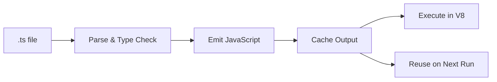

## Overview

Deno has first-class TypeScript support built into the runtime. You can run TypeScript files directly without any build step, configuration files, or additional tooling.

<Info>
Deno compiles TypeScript to JavaScript on the fly, caching the compiled output for fast subsequent runs.
</Info>

## Zero Configuration

Unlike traditional TypeScript setups, Deno requires:

- ❌ No `tsconfig.json`
- ❌ No `package.json`
- ❌ No build tools
- ❌ No transpiler configuration
- ✅ Just run `.ts` files directly

```bash
# Create a TypeScript file
echo 'console.log("Hello" as string);' > hello.ts

# Run it immediately
deno run hello.ts
```

## How It Works

From the Deno source code (`cli/tsc/README.md`), the TypeScript compilation process:



### Compilation Pipeline

1. **Parse**: Read and parse TypeScript source
2. **Type Check**: Validate types (if enabled)
3. **Emit**: Transform to JavaScript
4. **Cache**: Store compiled output
5. **Execute**: Run in V8 engine

## Type Checking Modes

Deno offers flexible type checking:

### Full Type Checking

```bash
# Type check before running (default in Deno 2.0+)
deno run script.ts

# Explicit type checking
deno check script.ts
```

### Skip Type Checking

For faster iteration during development:

```bash
# Skip type checking, only transform syntax
deno run --no-check script.ts
```

### Check Remote Code

```bash
# Type check including remote dependencies
deno check --remote script.ts
```

## TypeScript Configuration

While not required, you can customize TypeScript behavior:

<CodeGroup>
```json deno.json
{
  "compilerOptions": {
    "strict": true,
    "noImplicitAny": true,
    "strictNullChecks": true,
    "noUnusedLocals": true,
    "noUnusedParameters": true
  }
}
```
</CodeGroup>

<Note>
Deno automatically sets sensible defaults. You only need to configure options when overriding defaults.
</Note>

## Supported TypeScript Features

Deno supports modern TypeScript out of the box:

### Type Annotations

```typescript
function greet(name: string): string {
  return `Hello, ${name}!`;
}

const count: number = 42;
const items: Array<string> = ["a", "b", "c"];
```

### Interfaces and Types

```typescript
interface User {
  id: number;
  name: string;
  email?: string;
}

type Result<T> = 
  | { success: true; data: T }
  | { success: false; error: string };

function getUser(id: number): Result<User> {
  // ...
}
```

### Generics

```typescript
function identity<T>(arg: T): T {
  return arg;
}

class Container<T> {
  constructor(private value: T) {}
  
  getValue(): T {
    return this.value;
  }
}
```

### Enums

```typescript
enum Direction {
  North,
  South,
  East,
  West,
}

const dir: Direction = Direction.North;
```

### Decorators

Experimental decorators are supported:

```typescript
function logged(target: any, propertyKey: string, descriptor: PropertyDescriptor) {
  const original = descriptor.value;
  descriptor.value = function (...args: any[]) {
    console.log(`Calling ${propertyKey}`);
    return original.apply(this, args);
  };
}

class Service {
  @logged
  process(data: string) {
    return data.toUpperCase();
  }
}
```

### Namespace Support

```typescript
namespace Utils {
  export function format(value: number): string {
    return value.toFixed(2);
  }
}

Utils.format(3.14159);
```

## Type Definitions

### Built-in Types

Deno provides comprehensive type definitions:

```typescript
// Deno namespace types are built-in
const file: Deno.FsFile = await Deno.open("file.txt");
const info: Deno.FileInfo = await Deno.stat("file.txt");

// Web standard APIs
const response: Response = await fetch("https://deno.land");
const encoder: TextEncoder = new TextEncoder();
```

### Library References

From the source code, Deno provides different type libraries:

```typescript
/// <reference lib="deno.window" />
// For main runtime (default)

/// <reference lib="deno.worker" />
// For web workers

/// <reference lib="deno.ns" />
// Core Deno namespace
```

### Third-Party Types

```typescript
// Types come with JSR packages
import { assertEquals } from "jsr:@std/assert";

// npm packages with @types
import express from "npm:express";
import type { Request } from "npm:@types/express";

// Inline type declarations
import type { User } from "https://example.com/types.ts";
```

## Type-Only Imports

Import types without runtime cost:

```typescript
// Import only types
import type { User, Post } from "./types.ts";

// Mixed import
import { database, type Config } from "./database.ts";

// Type-only export
export type { User, Post };
export { createUser };
```

## JSX/TSX Support

Deno supports JSX and TSX out of the box:

<CodeGroup>
```tsx Component.tsx
import { h } from "preact";

interface Props {
  name: string;
  age: number;
}

export function Greeting({ name, age }: Props) {
  return (
    <div>
      <h1>Hello, {name}!</h1>
      <p>Age: {age}</p>
    </div>
  );
}
```

```json deno.json
{
  "compilerOptions": {
    "jsx": "react-jsx",
    "jsxImportSource": "preact"
  }
}
```
</CodeGroup>

## Declaration Files

### Generating Declarations

```bash
# Generate .d.ts files
deno run --emit=declarations script.ts
```

### Using Declaration Files

```typescript
// types.d.ts
declare module "my-module" {
  export function doSomething(): void;
}

// main.ts
import { doSomething } from "my-module";
```

### Ambient Declarations

```typescript
// global.d.ts
declare global {
  interface Window {
    myCustomProperty: string;
  }
}

// Now available globally
window.myCustomProperty = "value";
```

## TypeScript Compiler Integration

From `cli/tsc/README.md`, Deno uses:

- **Microsoft TypeScript**: Full TypeScript compiler
- **typescript-go**: Experimental Go-based compiler (faster)
- **Custom integration**: Runtime-specific optimizations

```rust
// Deno's TypeScript integration provides:
// - Custom module resolution
// - Multiple library contexts (window/worker)
// - Node.js compatibility layer
// - Special handling for global symbols
```

## Fast Refresh with --watch

Automatic recompilation on file changes:

```bash
# Watch mode
deno run --watch script.ts

# Watch with type checking
deno run --watch --check script.ts
```

When a file changes:
1. Deno detects the modification
2. Invalidates affected cache
3. Recompiles changed files
4. Restarts the program

## Performance Optimization

### Incremental Compilation

Deno caches compiled outputs:

```
$DENO_DIR/gen/
  file/
    home/user/project/
      script.ts.js        # Compiled JavaScript
      script.ts.meta      # Type information
      script.ts.buildinfo # Incremental state
```

### Code Cache

V8 code cache for faster subsequent runs:

```typescript
// First run: ~200ms (compile + execute)
// Second run: ~20ms (cache hit)
```

### Skip Type Checking in Development

```bash
# Fast iteration
deno run --no-check script.ts

# Production deployment
deno check script.ts && deno run script.ts
```

## Common Patterns

<AccordionGroup>
  <Accordion title="Type-Safe Configuration">
    ```typescript
    interface Config {
      port: number;
      host: string;
      debug: boolean;
    }
    
    const config: Config = {
      port: 8000,
      host: "localhost",
      debug: true,
    };
    ```
  </Accordion>

  <Accordion title="Strict Null Checks">
    ```typescript
    // Deno enables strict null checks by default
    function findUser(id: number): User | undefined {
      return users.find(u => u.id === id);
    }
    
    const user = findUser(1);
    // TypeScript error: Object possibly undefined
    console.log(user.name);
    
    // Correct
    if (user) {
      console.log(user.name);
    }
    ```
  </Accordion>

  <Accordion title="Type Guards">
    ```typescript
    interface Cat {
      meow(): void;
    }
    
    interface Dog {
      bark(): void;
    }
    
    function isCat(animal: Cat | Dog): animal is Cat {
      return 'meow' in animal;
    }
    
    function handlePet(pet: Cat | Dog) {
      if (isCat(pet)) {
        pet.meow(); // TypeScript knows it's a Cat
      } else {
        pet.bark(); // TypeScript knows it's a Dog
      }
    }
    ```
  </Accordion>

  <Accordion title="Utility Types">
    ```typescript
    interface User {
      id: number;
      name: string;
      email: string;
      role: string;
    }
    
    // Pick specific fields
    type UserPreview = Pick<User, "id" | "name">;
    
    // Omit fields
    type UserWithoutId = Omit<User, "id">;
    
    // Make all fields optional
    type PartialUser = Partial<User>;
    
    // Make all fields required
    type RequiredUser = Required<PartialUser>;
    
    // Make all fields readonly
    type ImmutableUser = Readonly<User>;
    ```
  </Accordion>
</AccordionGroup>

## Troubleshooting

<Warning>
If you encounter type errors, try:

```bash
# Clear the cache
deno cache --reload script.ts

# Explicit type checking
deno check --all script.ts
```
</Warning>

### Common Issues

```typescript
// Issue: Implicit any
function process(data) {  // ❌ Parameter 'data' implicitly has 'any' type
  return data.value;
}

// Solution: Add type annotation
function process(data: { value: string }) {  // ✅
  return data.value;
}
```

## Migration from Node.js

Key differences when migrating TypeScript from Node.js:

<CardGroup cols={2}>
  <Card title="No tsconfig.json" icon="file-slash">
    Deno uses sensible defaults, no config file needed
  </Card>
  
  <Card title="No node_modules" icon="folder-slash">
    Direct URL imports instead of npm packages
  </Card>
  
  <Card title="File extensions required" icon="file-code">
    Always use `.ts` extension in imports
  </Card>
  
  <Card title="Strict mode by default" icon="shield">
    All strict TypeScript options enabled
  </Card>
</CardGroup>

<Card title="Next Steps" icon="arrow-right">
Learn about [Module System](/concepts/modules) to understand how TypeScript modules are loaded and resolved.
</Card>