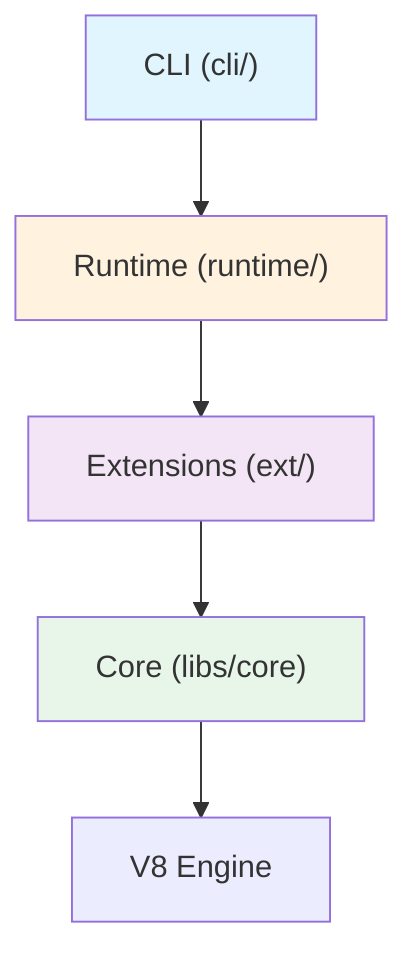

The Deno repository is organized into several key directories, each serving a specific purpose in the runtime's architecture.

## High-Level Overview

Deno's architecture separates concerns into distinct layers:

- **CLI Layer** (`cli/`) - User-facing interface and high-level integration
- **Runtime Layer** (`runtime/`) - JavaScript runtime assembly and worker management
- **Extensions Layer** (`ext/`) - Native functionality exposed to JavaScript
- **Core Libraries** (`libs/`) - Shared utilities and foundational components

<Note>
The `deno` crate (in `cli/`) provides the user-visible interface, while `deno_runtime` (`runtime/`) assembles the JavaScript runtime with all extensions.
</Note>

## Top-Level Directories

### `cli/` - CLI Implementation

The user-facing CLI implementation, containing:

```bash
cli/
├── args/              # Command-line argument parsing
│   └── flags.rs       # Flag definitions and parsing
├── tools/             # CLI subcommands and tools
│   ├── fmt.rs         # Code formatting (deno fmt)
│   ├── lint/          # Linting (deno lint)
│   ├── test/          # Test runner (deno test)
│   ├── bundle/        # Bundling (deno bundle)
│   ├── compile.rs     # Compilation (deno compile)
│   ├── doc.rs         # Documentation (deno doc)
│   ├── repl/          # REPL implementation
│   ├── bench/         # Benchmarking (deno bench)
│   ├── coverage/      # Coverage reporting
│   └── ...
├── main.rs            # Entry point and command routing
├── module_loader.rs   # Module loading and resolution
├── file_fetcher.rs    # Remote file fetching
├── graph_util.rs      # Module graph utilities
├── npm.rs             # npm package support
├── jsr.rs             # JSR registry integration
└── worker.rs          # CLI worker setup
```

**Key Files:**
- `cli/main.rs` - Entry point, delegates to `lib.rs`
- `cli/lib.rs` - Main application logic and command routing
- `cli/args/flags.rs` - All CLI flags and subcommand definitions
- `cli/module_loader.rs` - Module loading and resolution logic
- `cli/file_fetcher.rs` - Fetching and caching remote modules

### `runtime/` - JavaScript Runtime

Assembles the JavaScript runtime and manages execution contexts:

```bash
runtime/
├── worker.rs          # Worker/runtime initialization
├── web_worker.rs      # Web worker implementation
├── permissions/       # Permission system
├── ops/               # Runtime-specific ops
├── js/                # Runtime JavaScript code
├── fmt_errors.rs      # Error formatting
└── snapshot.rs        # V8 snapshot generation
```

**Key Concepts:**
- **Workers** - JavaScript execution contexts (main worker, web workers)
- **Permissions** - Runtime permission system for security
- **Bootstrap** - Runtime initialization and setup
- **Ops** - Rust functions exposed to JavaScript

### `ext/` - Extensions

Extensions provide native functionality to JavaScript. Each extension is a separate crate:

```bash
ext/
├── broadcast_channel/ # BroadcastChannel API
├── cache/             # Cache API
├── console/           # Console API
├── crypto/            # Web Crypto API
├── fetch/             # Fetch API
├── ffi/               # Foreign Function Interface
├── fs/                # File system operations
├── http/              # HTTP server
├── io/                # I/O primitives
├── kv/                # Key-Value store (Deno KV)
├── net/               # Network operations
├── node/              # Node.js compatibility
├── url/               # URL API
├── web/               # Web APIs (DOM, Events, etc.)
├── webgpu/            # WebGPU API
└── websocket/         # WebSocket API
```

**Extension Structure:**
Each extension typically contains:
- `lib.rs` - Extension definition, ops registration
- `*.rs` files - Rust implementation of ops
- `*.js` files - JavaScript API wrappers
- `Cargo.toml` - Crate dependencies

<CodeGroup>
```rust ext/fs/lib.rs
// Extension definition
deno_core::extension!(deno_fs,
  deps = [ deno_web ],
  ops = [
    op_fs_open_sync,
    op_fs_open_async,
    op_fs_read_file_sync,
    op_fs_write_file_async,
    // ...
  ],
  esm = [ "30_fs.js" ],
);
```

```javascript ext/fs/30_fs.js
// JavaScript API wrapper
function readFileSync(path) {
  return op_fs_read_file_sync(path);
}

function writeFile(path, data) {
  return op_fs_write_file_async(path, data);
}
```
</CodeGroup>

### `libs/` - Core Libraries

Shared libraries and foundational components:

```bash
libs/
├── core/              # deno_core - V8 integration
├── ops/               # Op macro and utilities
├── serde_v8/          # V8 <-> Rust serialization
├── node_resolver/     # Node module resolution
├── npm/               # npm package handling
├── lockfile/          # Lock file management
├── config/            # Configuration file parsing
└── ...
```

**Important Libraries:**
- `deno_core` - Core V8 integration and op system
- `ops` - Procedural macros for defining ops
- `serde_v8` - Serialization between Rust and V8
- `node_resolver` - Node.js module resolution algorithm

### `tests/` - Test Suite

Comprehensive test coverage:

```bash
tests/
├── specs/             # Spec tests (integration tests)
│   ├── __test__.jsonc # Test definitions
│   ├── run/           # deno run tests
│   ├── lint/          # deno lint tests
│   ├── fmt/           # deno fmt tests
│   └── ...
├── unit/              # Unit tests
├── unit_node/         # Node.js compatibility tests
├── testdata/          # Test fixtures and data
├── wpt/               # Web Platform Tests
└── util/              # Test utilities
```

<Info>
Spec tests are the primary integration test format. See [Testing](/contributing/testing) for details.
</Info>

### `tools/` - Development Tools

Scripts and utilities for development:

```bash
tools/
├── format.js          # Code formatting script
├── lint.js            # Linting script
├── release/           # Release automation
├── wpt/               # Web Platform Tests runner
└── ...
```

## Key Files

### Configuration Files

- `Cargo.toml` - Workspace configuration for all Rust crates
- `Cargo.lock` - Locked dependency versions
- `import_map.json` - Import map for Deno's own code
- `rust-toolchain.toml` - Rust toolchain version
- `.dprint.json` - Code formatting configuration
- `.dlint.json` - Linting configuration

### Documentation

- `README.md` - Project overview and quick start
- `CLAUDE.md` - Development guide (this documentation source)
- `Releases.md` - Release history
- `LICENSE.md` - MIT license

## Architecture Flow



1. **CLI** parses arguments and routes to appropriate tool
2. **Runtime** initializes workers and sets up execution environment
3. **Extensions** provide native APIs to JavaScript
4. **Core** interfaces with V8 and manages the op system

## Common Patterns

### Ops (Operations)

Rust functions exposed to JavaScript:

```rust
// In ext/fs/ops.rs
#[op2]
#[string]
fn op_fs_cwd() -> Result<String, FsError> {
  std::env::current_dir()
    .map(|p| p.to_string_lossy().to_string())
    .map_err(FsError::from)
}
```

### Extensions

Collections of ops and JS code:

```rust
deno_core::extension!(
  my_extension,
  deps = [ deno_web ],  // Dependencies on other extensions
  ops = [ op_foo, op_bar ],  // Ops to expose
  esm = [ "my_extension.js" ],  // JavaScript code
);
```

### Resources

Managed objects passed between Rust and JS (files, sockets, etc.):

```rust
struct FileResource {
  file: AsyncRefCell<File>,
}

impl Resource for FileResource {
  fn name(&self) -> Cow<str> {
    "file".into()
  }
}
```

## Finding Your Way

<AccordionGroup>
  <Accordion title="Adding a new CLI command">
    1. Define flags in `cli/args/flags.rs`
    2. Create handler in `cli/tools/<command>.rs`
    3. Wire up in `cli/lib.rs`
    4. Add spec tests in `tests/specs/<command>/`
  </Accordion>

  <Accordion title="Adding a new extension">
    1. Create directory in `ext/<name>/`
    2. Define ops in Rust
    3. Create JavaScript wrapper
    4. Register in `runtime/worker.rs`
    5. Add to workspace `Cargo.toml`
  </Accordion>

  <Accordion title="Modifying an existing op">
    1. Find the op in `ext/<extension>/`
    2. Modify the Rust implementation
    3. Update JavaScript wrapper if needed
    4. Update or add tests
  </Accordion>
</AccordionGroup>

## Next Steps

<CardGroup cols={2}>
  <Card title="Runtime Internals" icon="gear" href="/contributing/runtime-internals">
    Learn how the runtime works internally
  </Card>
  <Card title="Extensions" icon="puzzle-piece" href="/contributing/extensions">
    Working with Deno extensions
  </Card>
  <Card title="Testing" icon="flask" href="/contributing/testing">
    Running and writing tests
  </Card>
  <Card title="Debugging" icon="bug" href="/contributing/debugging">
    Debugging techniques
  </Card>
</CardGroup>