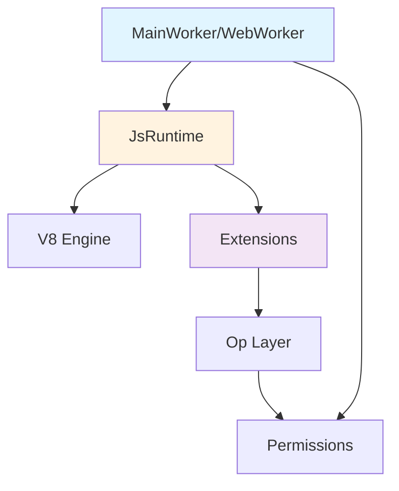

This guide explains how Deno's runtime works internally, from initialization to executing JavaScript code.

## Runtime Architecture

The Deno runtime is built on several key components:



## Core Components

### JsRuntime

`JsRuntime` is the core execution environment from `deno_core`. It manages:

- V8 isolate and context
- Module loading and evaluation
- Op registration and dispatch
- Event loop integration
- Snapshot creation/loading

```rust
// Creating a JsRuntime
let runtime = JsRuntime::new(RuntimeOptions {
  module_loader: Some(Rc::new(module_loader)),
  extensions: vec![
    deno_web::deno_web::init_ops_and_esm(...),
    deno_fetch::deno_fetch::init_ops_and_esm(...),
    // ...
  ],
  ..Default::default()
});
```

### Workers

Workers are JavaScript execution contexts. Deno has two types:

1. **MainWorker** - The primary execution context for the main module
2. **WebWorker** - Background workers created via `new Worker()`

**Location:** `runtime/worker.rs` and `runtime/web_worker.rs`

<CodeGroup>
```rust MainWorker Creation
// From runtime/worker.rs
pub struct MainWorker {
  js_runtime: JsRuntime,
  should_break_on_first_statement: bool,
  should_wait_for_inspector_session: bool,
  exit_code: ExitCode,
}

impl MainWorker {
  pub fn bootstrap(&mut self, options: &BootstrapOptions) {
    // Initialize runtime with bootstrap options
    self.execute_script(
      "[deno:runtime/bootstrap.js]",
      bootstrap_code,
    )
  }
}
```

```rust Worker Bootstrap
// Bootstrap options passed to runtime
pub struct BootstrapOptions {
  pub args: Vec<String>,
  pub cpu_count: usize,
  pub log_level: Level,
  pub enable_op_summary_metrics: bool,
  pub enable_testing_features: bool,
  pub locale: String,
  pub location: Option<ModuleSpecifier>,
  pub no_color: bool,
  pub is_tty: bool,
  pub unstable: bool,
  // ...
}
```
</CodeGroup>

### Extensions

Extensions bundle ops and JavaScript code together. They're registered when creating a `JsRuntime`.

**Key Extension Properties:**
- **deps** - Dependencies on other extensions
- **ops** - Rust functions exposed to JavaScript
- **esm** - JavaScript/TypeScript modules
- **state** - Extension-specific state initialization

```rust
deno_core::extension!(
  deno_fetch,
  deps = [ deno_web, deno_url, deno_webidl ],
  ops = [
    op_fetch,
    op_fetch_send,
    op_fetch_response_read,
    // ...
  ],
  esm = [
    "20_headers.js",
    "26_fetch.js",
  ],
  state = |state| {
    state.put(HttpClient::new());
  },
);
```

## The Op System

Ops (operations) are the bridge between JavaScript and Rust. They're synchronous or asynchronous functions that can be called from JavaScript.

### Defining Ops

Ops are defined using the `#[op2]` macro:

<CodeGroup>
```rust Synchronous Op
#[op2]
#[string]
fn op_fs_cwd() -> Result<String, FsError> {
  std::env::current_dir()
    .map(|p| p.to_string_lossy().to_string())
    .map_err(FsError::from)
}
```

```rust Asynchronous Op
#[op2(async)]
async fn op_read_file(
  #[string] path: String,
) -> Result<Vec<u8>, FsError> {
  tokio::fs::read(path)
    .await
    .map_err(FsError::from)
}
```

```rust Op with State
#[op2(fast)]
fn op_get_random_values(
  state: &mut OpState,
  #[buffer] buf: &mut [u8],
) -> Result<(), AnyError> {
  let rng = state.borrow_mut::<RngState>();
  rng.fill(buf)?;
  Ok(())
}
```
</CodeGroup>

### Op Attributes

- `#[op2]` - Basic op definition
- `#[op2(async)]` - Async op returning a future
- `#[op2(fast)]` - Fast call optimization (no V8 context switch)
- `#[string]` - Return value is a string
- `#[smi]` - Value is a small integer
- `#[buffer]` - Parameter is a buffer/byte array

### Calling Ops from JavaScript

Ops are automatically exposed to JavaScript:

```javascript
// Synchronous op
const cwd = Deno.core.ops.op_fs_cwd();

// Asynchronous op
const data = await Deno.core.ops.op_read_file("/path/to/file");
```

Typically wrapped in higher-level APIs:

```javascript
// In ext/fs/30_fs.js
function cwd() {
  return op_fs_cwd();
}

function readFile(path) {
  return op_read_file(path);
}
```

## Module Loading

Deno's module loading happens in several stages:

### 1. Module Resolution

Convert specifiers to absolute URLs:

```rust
// cli/module_loader.rs
impl ModuleLoader for CliModuleLoader {
  fn resolve(
    &self,
    specifier: &str,
    referrer: &str,
    kind: ResolutionKind,
  ) -> Result<ModuleSpecifier, Error> {
    // Resolve relative imports, npm: specifiers, etc.
    resolve_import(specifier, referrer)
  }
}
```

### 2. Module Loading

Fetch and cache module source:

```rust
fn load(
  &self,
  module_specifier: &ModuleSpecifier,
  maybe_referrer: Option<&ModuleSpecifier>,
  is_dynamic: bool,
) -> Pin<Box<ModuleLoadFuture>> {
  // Fetch from cache or network
  // Transpile TypeScript if needed
  // Return module source
}
```

### 3. Module Evaluation

Execute module code in V8:

```rust
// In JsRuntime
let mod_id = runtime.load_main_module(&main_module, None).await?;
let result = runtime.mod_evaluate(mod_id).await?;
```

## Permission System

The permission system controls access to sensitive operations.

**Location:** `runtime/permissions/`

### Permission Types

```rust
pub struct Permissions {
  pub read: PermissionState,
  pub write: PermissionState,
  pub net: PermissionState,
  pub env: PermissionState,
  pub sys: PermissionState,
  pub run: PermissionState,
  pub ffi: PermissionState,
  pub hrtime: PermissionState,
}
```

### Permission Checking

Ops check permissions before executing:

```rust
#[op2]
fn op_read_file(
  state: &mut OpState,
  #[string] path: String,
) -> Result<Vec<u8>, AnyError> {
  let permissions = state.borrow_mut::<PermissionsContainer>();
  permissions.check_read(&path)?;
  
  // Perform operation
  std::fs::read(&path).map_err(Into::into)
}
```

<Warning>
Always check permissions in ops that access system resources. Never skip permission checks even for "safe" operations.
</Warning>

## Event Loop

Deno's event loop integrates Tokio with V8:

```rust
// Poll event loop until completion
pub async fn run_event_loop(
  &mut self,
  wait_for_inspector: bool,
) -> Result<(), Error> {
  loop {
    self.js_runtime.run_event_loop(PollEventLoopOptions {
      wait_for_inspector,
      pump_v8_message_loop: true,
    }).await?;
    
    if !self.js_runtime.has_pending_events() {
      break;
    }
  }
  Ok(())
}
```

### Event Loop Phases

1. **Execute JavaScript** - Run queued microtasks and callbacks
2. **Poll async ops** - Check for completed async operations
3. **Process timers** - Fire any due timers
4. **Check for work** - If no pending work, exit loop

## Resources

Resources represent system handles (files, sockets, etc.) managed by Deno.

### Defining Resources

```rust
use deno_core::Resource;

struct FileResource {
  file: AsyncRefCell<tokio::fs::File>,
  cancel: CancelHandle,
}

impl Resource for FileResource {
  fn name(&self) -> Cow<str> {
    "fsFile".into()
  }
  
  fn close(self: Rc<Self>) {
    self.cancel.cancel();
  }
}
```

### Using Resources

```rust
// Creating a resource
let file = tokio::fs::File::open(path).await?;
let resource = FileResource {
  file: AsyncRefCell::new(file),
  cancel: CancelHandle::new(),
};
let rid = state.resource_table.add(resource);

// Using a resource
let resource = state.resource_table.get::<FileResource>(rid)?;
let mut file = resource.file.borrow_mut().await;
file.read(&mut buffer).await?;
```

## Snapshots

Snapshots allow fast startup by pre-initializing V8 state.

### Creating Snapshots

```rust
let snapshot = JsRuntime::create_snapshot(
  RuntimeOptions {
    extensions: vec![/* extensions */],
    ..Default::default()
  },
  snapshot_module,
)?;

std::fs::write("snapshot.bin", snapshot)?;
```

### Loading Snapshots

```rust
let runtime = JsRuntime::new(RuntimeOptions {
  startup_snapshot: Some(include_bytes!("snapshot.bin")),
  ..Default::default()
});
```

<Info>
Snapshots significantly reduce startup time by avoiding re-parsing and re-compiling standard library code.
</Info>

## Inspector/Debugger

Deno supports Chrome DevTools Protocol for debugging:

```rust
// Enable inspector
let inspector_server = get_inspector_server();

runtime.inspector().borrow_mut().wait_for_session_and_break_on_next_statement(
  "file:///main.ts"
);
```

**Using the inspector:**

```bash
# Start with inspector
./target/debug/deno run --inspect-brk main.ts

# Connect Chrome DevTools to chrome://inspect
```

## Performance Considerations

### Fast Calls

Use `#[op2(fast)]` for hot path operations:

```rust
#[op2(fast)]
fn op_fast_add(a: i32, b: i32) -> i32 {
  a + b
}
```

Fast calls avoid V8 context switches and can be 10-100x faster.

### Batching

Batch multiple operations into single op calls:

```rust
#[op2]
fn op_batch_read(
  #[serde] paths: Vec<String>,
) -> Result<Vec<Vec<u8>>, AnyError> {
  paths.iter()
    .map(|path| std::fs::read(path))
    .collect()
}
```

### Resource Pooling

Reuse expensive resources:

```rust
// Pool HTTP clients
struct HttpClientPool {
  clients: Vec<Client>,
}

impl HttpClientPool {
  fn get(&mut self) -> Client {
    self.clients.pop().unwrap_or_else(Client::new)
  }
  
  fn return_client(&mut self, client: Client) {
    self.clients.push(client);
  }
}
```

## Common Patterns

<AccordionGroup>
  <Accordion title="Adding state to extensions">
    ```rust
    deno_core::extension!(
      my_extension,
      ops = [ /* ... */ ],
      state = |state| {
        state.put(MyState::new());
      },
    );
    ```
  </Accordion>

  <Accordion title="Accessing state in ops">
    ```rust
    #[op2]
    fn op_use_state(state: &mut OpState) -> Result<String, AnyError> {
      let my_state = state.borrow::<MyState>();
      Ok(my_state.get_value())
    }
    ```
  </Accordion>

  <Accordion title="Cancellable async operations">
    ```rust
    #[op2(async)]
    async fn op_sleep(state: Rc<RefCell<OpState>>, millis: u64) {
      let cancel = state.borrow().borrow::<CancelHandle>().clone();
      
      tokio::select! {
        _ = tokio::time::sleep(Duration::from_millis(millis)) => {},
        _ = cancel.cancelled() => {},
      }
    }
    ```
  </Accordion>
</AccordionGroup>

## Next Steps

<CardGroup cols={2}>
  <Card title="Extensions" icon="puzzle-piece" href="/contributing/extensions">
    Learn how to work with extensions
  </Card>
  <Card title="Debugging" icon="bug" href="/contributing/debugging">
    Debug runtime issues
  </Card>
</CardGroup>